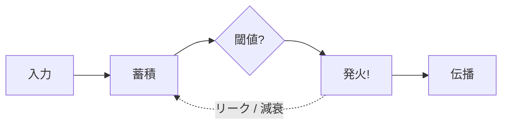
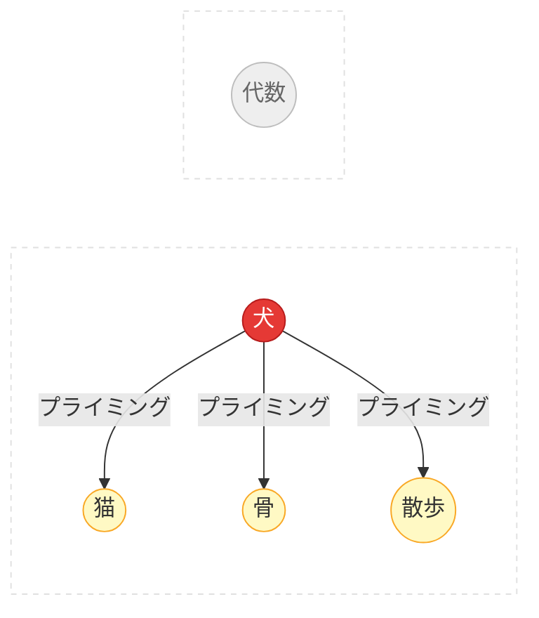

# 付録: アルゴリズムと技術的詳細

Spikuitの技術的な裏側を解説するページです。
概要は[コンセプト](concepts.ja.md)を参照。

---

## 1. 計算神経科学

Spikuitは神経科学の仕組みを簡略化して、知識のダイナミクスに応用しています。

### ニューロンとスパイク



- 生物のニューロンは電気パルス（活動電位）でやり取りする
- 入力が蓄積して閾値を超えると発火し、リセットされる
- Spikuitでは: `Spike` = 復習イベント。発火するとつながった知識に信号が伝わる

### シナプス可塑性 (STDP)

> 「一緒に発火するニューロンは結びつく」 — Hebb, 1949

STDPはHebbの法則に「時間の向き」を加えた精緻化です:

<div class="chart-container">
  <canvas data-chart="stdp"></canvas>
</div>

- プレがポストより先に発火（因果的）→ 接続が強��る（LTP）
- ポストがプレより先に発火（逆因果）→ 接続が弱まる（LTD）
- 変化量は`|dt|`に対して指数的に減衰
- Spikuitでは: `tau_stdp`日（デフォルト: 7）以内の共発火でエッジ重みを更新

### 漏れ積分発火モデル (LIF)

<div class="chart-container">
  <canvas data-chart="lif"></canvas>
</div>

- ニューロンは入力を蓄積（積分）しつつ、徐々に電荷が抜けていく（漏��）
- 圧力が高い = 「この概念は復習したほうがいい」というシグナル
- Spikuitでは: 近傍の復習で圧力が上がり、時間とともに指数的に減衰

### 活性化拡散



- ある概念を活性化すると、関連する概念も一緒にプライミングされる（Collins & Loftus, 1975）
- Spikuitでは: 1つのノードを復習するとAPPNP（Personalized PageRank）でグラフ近傍に活性化が広がる

### 睡眠にヒントを得た統合

睡眠中の記憶統合には複数のフェーズがあります:

- **徐波睡眠 (SWS)**: 大事な記憶をリプレイして強化する
- **シナプスホメオスタシス (SHY)**: シナプスの重みを全体的に下げて飽和を防ぐ（Tononi & Cirelli, 2003）
- **REM**: 記憶を再編成・抽象化し、パターンを見つけ出す

Spikuitの`consolidate`はこれを4フェーズの計画として実行します: Triage（Synapseの分類）→ SHY（弱い接続の減衰）→ SWS（不要な接続の剪定）→ REM（統合機会の検出）

### 参考文献 — 計算神経科学

- Hodgkin, A. L. & Huxley, A. F. (1952). A quantitative description of membrane current and its application to conduction and excitation in nerve. *Journal of Physiology*, 117(4), 500–544.
- Hebb, D. O. (1949). *The Organization of Behavior*. Wiley.
- Bi, G. & Poo, M. (1998). Synaptic modifications in cultured hippocampal neurons: dependence on spike timing, synaptic strength, and postsynaptic cell type. *Journal of Neuroscience*, 18(24), 10464–10472.
- Collins, A. M. & Loftus, E. F. (1975). A spreading-activation theory of semantic processing. *Psychological Review*, 82(6), 407–428.
- Tononi, G. & Cirelli, C. (2003). Sleep and synaptic homeostasis: a hypothesis. *Brain Research Bulletin*, 62(2), 143–150.
- Tononi, G. & Cirelli, C. (2014). Sleep and the price of plasticity: from synaptic and cellular homeostasis to memory consolidation and integration. *Neuron*, 81(1), 12–34.

---

## 2. 認知・発達心理学

### 忘却曲線と間隔反復

<div class="chart-container">
  <canvas data-chart="forgetting-curve"></canvas>
</div>

- 記憶は時間とともに指数的に薄れる（Ebbinghaus, 1885）
- うまく思い出すたびに記憶の痕跡が強化され、次に忘れるまでの間隔が延びる
- 最適なタイミング: 忘れかけた頃に復習する
- Spikuitでは: FSRS v6がNeuronごとの安定性と難易度をモデル化

### テスティング効果

- 自分で思い出すほうが、読み返すより定着する（Roediger & Karpicke, 2006）
- 思い出せなかった場合でも、思い出そうとした試み自体が後の記憶を助ける
- Spikuitでは: 「見せて終わり」ではなく「出題→評価」の形式を採用

### ZPDとスキャフォールディング

<div class="zpd-diagram">
  <div class="zpd-outer">
    <span class="zpd-label">まだできない</span>
    <div class="zpd-mid">
      <span class="zpd-label">ZPD: 支援があればできる</span>
      <div class="zpd-inner">
        <span class="zpd-label">一人でできる</span>
        <span class="zpd-sublabel">（習得済み）</span>
      </div>
    </div>
  </div>
</div>

- ZPD（Vygotsky, 1978）: 一人でできることと、助けがあればできることの間の領域
- スキャフォールディング（Wood, Bruner & Ross, 1976）: できるようになるにつれて少しずつ外していく一時的な支え
- Spikuitでは: FSRS状態 + グラフ近傍からScaffoldレベルを算出

### スキーマ理論

- スキーマ = 知識���整理するための心の枠組み（Bartlett, 1932; Piaget）
- 新しい情報は既存のスキーマにつなげると覚えやすい
- Spikuitでは: ナレッジグラフ*そのもの*がスキーマ。`LearnSession.ingest()`が関連概念を自動で見つけ出す

### 参考文献 — 認知・発達心理学

- Ebbinghaus, H. (1885). *Über das Gedächtnis*. Duncker & Humblot.（英訳: *Memory: A Contribution to Experimental Psychology*, 1913.）
- Bartlett, F. C. (1932). *Remembering: A Study in Experimental and Social Psychology*. Cambridge University Press.
- Vygotsky, L. S. (1978). *Mind in Society: The Development of Higher Psychological Processes*. Harvard University Press.
- Wood, D., Bruner, J. S. & Ross, G. (1976). The role of tutoring in problem solving. *Journal of Child Psychology and Psychiatry*, 17(2), 89–100.
- Roediger, H. L. & Karpicke, J. D. (2006). Test-enhanced learning: taking memory tests improves long-term retention. *Psychological Science*, 17(3), 249–255.
- Piaget, J. (1952). *The Origins of Intelligence in Children*. International Universities Press.

---

## 3. 間隔反復システム

### FSRS (Free Spaced Repetition Scheduler)

Neuronごとに安定性・難易度・次回復習日を管理する間隔反復スケジューラ。
FSRS v6はニューラルネットワークベース���、
Ankiデフォルトの SM-2 より想起予測の精度が高いです。

- グラフ伝播はFSRS状態を変えません — 影響するのは圧力だけ
- 各Neuronが独立した安定性・難易度パラメータを持つ
- グレード対応: `miss` → Again, `weak` → Hard, `fire` → Good, `strong` → Easy

### 参考文献 — 間隔反復

- Ye, J. (2024). FSRS: A modern spaced repetition algorithm. [github.com/open-spaced-repetition/fsrs4anki](https://github.com/open-spaced-repetition/fsrs4anki)
- Wozniak, P. A. & Gorzelanczyk, E. J. (1994). Optimization of repetition spacing in the practice of learning. *Acta Neurobiologiae Experimentalis*, 54, 59–62.
- Leitner, S. (1972). *So lernt man lernen*. Herder.

---

## 4. ナレッジグラフとグラフベースML

### PageRankとAPPNP

- PageRank（Page et al., 1999）: リンク構造でノードの重要度を計算
- APPNP（Gasteiger et al., 2019）: テレポート確率で局所性を制御できるPersonalized PageRank
- Spikuitでは: 活性化の拡散と検索スコアリングに利用

### コミュニティ検出

- Louvainアルゴリズム（Blondel et al., 2008）: モジュラリティ最適化でコミュニティを検出
- Spikuitでは: 密につながったNeuronをクラスタにまとめ、検索のブーストや要約の自動生成に活用

### 参考文献 — ナレッジグラフとグラフベースML

- Page, L., Brin, S., Motwani, R. & Winograd, T. (1999). The PageRank Citation Ranking: Bringing Order to the Web. *Stanford InfoLab Technical Report*.
- Gasteiger, J., Bojchevski, A. & Günnemann, S. (2019). Predict then Propagate: Graph Neural Networks meet Personalized PageRank. *ICLR 2019*.
- Blondel, V. D., Guillaume, J.-L., Lambiotte, R. & Lefebvre, E. (2008). Fast unfolding of communities in large networks. *Journal of Statistical Mechanics*, P10008.

---

## 5. 情報検索とRAG

### ハイブリッド検索

Spikuitは複数のシグナルを1つのスコアに統合して検索します:

```
score = max(keyword_sim, semantic_sim) × (1 + retrievability + centrality + pressure + boost)
```

- **キーワード類似度**: BM25スタイルのテキストマッチング
- **セマンティック類似度**: エンベッダー設定時はsqlite-vecのKNN検索を利用
- **検索可能性**: FSRSベースの記憶の強さ — 定着している知識ほど上位に
- **中心性**: グラフ上の位置的な重要度
- **圧力**: 近傍の復習で蓄積するLIFベースの緊急度
- **フィードバックブースト**: QABotSessionの承認/不採用で蓄積される加点

### 検索拡張生成 (RAG)

従来のRAGパイプラインはドキュメントのチャンキング、メタデータ抽出、
エンベディングパイプラインの構築と、前処理の手間が大きいのが難点です。
Spikuitはこれを対話型キュレーションで置き換えます。エージェントが
`/spkt-learn` の会話を通じて、チャンキング・タグ付け・接続まで面倒を見ます。

### 参考文献 — 情報検索とRAG

- Robertson, S. & Zaragoza, H. (2009). The Probabilistic Relevance Framework: BM25 and Beyond. *Foundations and Trends in Information Retrieval*, 3(4), 333–389.
- Lewis, P. et al. (2020). Retrieval-Augmented Generation for Knowledge-Intensive NLP Tasks. *NeurIPS 2020*.

---

## アルゴリズム詳細

### APPNP伝播

Personalized PageRank拡散です:

```
Z = (1 - alpha) * A_hat @ Z + alpha * H
```

- `alpha` = テレポート確率（大きいほどローカル、デフォルト: 0.15）
- `A_hat` = 自己ループ付き正規化隣接行列
- `H` = 初期活性化（グレード依存）

### STDPエッジ重み更新

`tau_stdp`日以内の共発火タイミングでエッジ重みを更新します:

- プレがポストの前（LTP）: `dw = +a_plus * exp(-|dt| / tau)`
- ポストがプレの前（LTD）: `dw = -a_minus * exp(-|dt| / tau)`

### LIF圧力モデル

圧力は近傍の発火で蓄積し、指数的に減衰します:

```
pressure(t) = pressure * exp(-dt / tau_m)
```

### `fire()`の動作

```
circuit.fire(spike)
  1. スパイクをDBに記録
  2. FSRS: 安定性、難易度を更新、次回復習をスケジュール
  3. APPNP: 近傍に活性化を伝播（圧力デルタ）
  4. ソースニューロンの圧力をリセット
  5. STDP: 共発火タイミングに基づきエッジ重みを更新
  6. 将来のSTDP用にlast-fireタイムスタンプを記録
```

---

## 可塑性パラメータ

| パラメータ | デフォルト | 制御対象 |
|-----------|---------|---------|
| `alpha` | 0.15 | APPNPテレポート確率（局所性） |
| `propagation_steps` | 5 | APPNP反復回数 |
| `tau_stdp` | 7.0 | STDP時間窓（日） |
| `a_plus` | 0.03 | STDP LTP振幅 |
| `a_minus` | 0.036 | STDP LTD振幅 |
| `tau_m` | 14.0 | LIF膜時定数（日） |
| `pressure_threshold` | 0.8 | LIF圧力閾値 |
| `weight_floor` | 0.05 | 最小エッジ重み |
| `weight_ceiling` | 1.0 | 最大エッジ重み |

## エンベディングパイプライン

### 入力の前処理

エンベディング前に、Neuronコンテンツは以下のパイプラインを通ります:

```
生のNeuronコンテンツ
  → YAMLフロントマターを除去
  → フロントマターから [Section: ...] を付加（あれば）
  → Sourceのsearchableメタデータから [key: value] を付加（max_searchable_charsで切り詰め）
  → 最終エンベディング入力
```

構造的なノイズ（フロントマターのキーや書式）を取り除きつつ、
本文だけでは拾えない意味的な文脈をエンベディングに反映させます。

### タスクタイププレフィックス

エンベディングモデルの多くは、入力に目的（文書 or クエリ）を明示すると
精度が上がります。`config.toml` の `prefix_style` で設定できます:

```toml
[embedder]
prefix_style = "nomic"    # "nomic", "google", "cohere", "none"
```

| スタイル | 文書プレフィックス | クエリプレフィックス |
|---------|------------------|-------------------|
| `nomic` | `search_document: ` | `search_query: ` |
| `google` | `RETRIEVAL_DOCUMENT: ` | `RETRIEVAL_QUERY: ` |
| `cohere` | `search_document: ` | `search_query: ` |
| `none`（デフォルト） | — | — |

プレフィックスは自動で適用されます:
- `EmbeddingType.DOCUMENT` — Neuronの追加・更新、`embed-all` 実行時
- `EmbeddingType.QUERY` — `retrieve()` 呼び出し時

### searchableメタデータの結合式

Sourceにsearchableメタデータがある場合、エンベディング入力は:

```
[key1: value1] [key2: value2] [Section: section_name] 本文テキスト
```

`max_searchable_chars`（デフォルト: 500）を超える分は切り詰められ、
メタデータがエンベディングを支配しないようになっています。

## エンベッダープロバイダー

| プロバイダー | API | 用途 |
|------------|-----|------|
| `openai-compat` | `/v1/embeddings` | LM Studio, Ollama /v1, vLLM, OpenAI |
| `ollama` | `/api/embed` | Ollama ネイティブAPI |
| `none` | — | エンベディングなし（キーワード検索のみ） |

## ニューロンモデルのマッピング

| 脳 | Spikuit | 役割 |
|----|---------|------|
| ニューロン | `Neuron` | 知識の単位（Markdown） |
| シナプス | `Synapse` | 型付き・重み付きの接続 |
| スパイク | `Spike` | 復習イベント（活動電位） |
| 回路 | `Circuit` | ナレッジグラフ全体 |
| 可塑性 | `Plasticity` | チューニング可能な学習パラメータ |

## 技術スタック

| コンポーネント | 技術 |
|-------------|------|
| モデル | msgspec.Struct |
| ストレージ | SQLite (aiosqlite) + NetworkX + sqlite-vec |
| スケジューリング | FSRS v6 |
| エンベディング | httpx (OpenAI-compat / Ollama) |
| CLI | Typer |
| 可視化 | pyvis (vis.js) |
| 言語 | Python 3.11+ |
