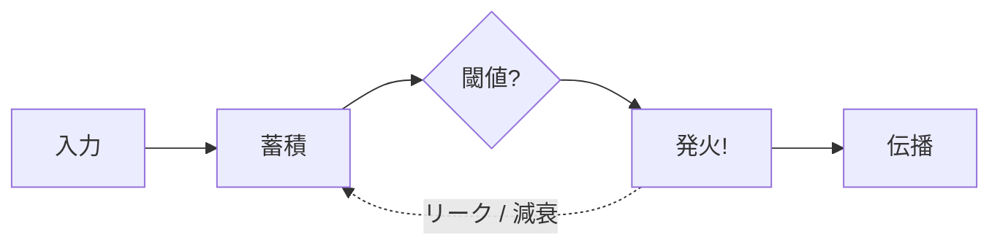
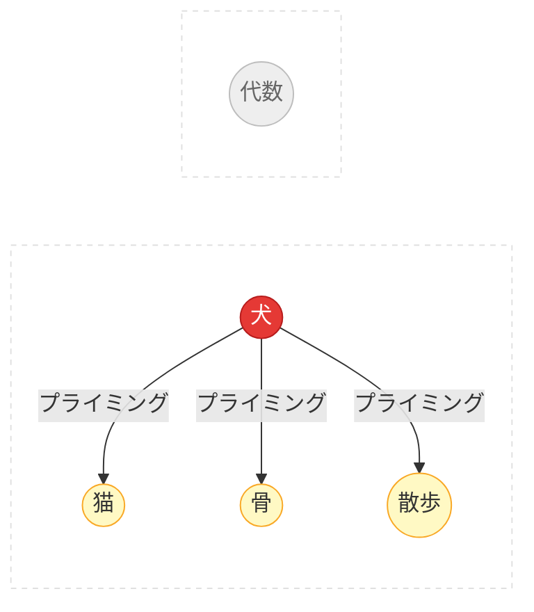

# 付録: アルゴリズムと技術的詳細

このページではSpikuitの技術的基盤を解説します。概要は
[コンセプト](concepts.ja.md)を参照してください。

## 理論的背景

Spikuitは3つの分野から着想を得ています：

### 神経科学

**ニューロンとスパイク**



- 生物学的ニューロンは離散的な電気パルス（活動電位）で通信する
- ニューロンは入力を蓄積し、閾値を超えると発火してリセットする
- Spikuitでは: `Spike` = 復習イベント; 発火は接続された知識に信号を伝播

**シナプス可塑性 (STDP)**

> 「一緒に発火するニューロンは結びつく」 — Hebb, 1949

スパイクタイミング依存可塑性はHebbの法則に時間方向を加えます：

<div class="chart-container">
  <canvas data-chart="stdp"></canvas>
</div>

- プレがポストの前に発火（因果的）→ 接続が強化（LTP）
- ポストがプレの前に発火（逆因果）→ 接続が弱化（LTD）
- 大きさは`|dt|`で指数的に減衰
- Spikuitでは: `tau_stdp`日（デフォルト: 7）以内の共発火でエッジ重みが更新

**漏れ積分発火モデル (LIF)**

<div class="chart-container">
  <canvas data-chart="lif"></canvas>
</div>

- ニューロンは入力を蓄積し（積分）、徐々に電荷を失う（漏れ）
- 高い圧力 = システムが「このコンセプトは復習が必要」と伝えている
- Spikuitでは: 近傍の復習が圧力を上げ、時間が指数的に減衰させる

**活性化拡散**



- 記憶内のコンセプトを活性化すると関連コンセプトがプライミングされる（Collins & Loftus, 1975）
- Spikuitでは: 1つのノードの復習がAPPNP（Personalized PageRank）経由でグラフ近傍に活性化を伝播

### 認知・発達心理学

**忘却曲線と間隔反復**

<div class="chart-container">
  <canvas data-chart="forgetting-curve"></canvas>
</div>

- 記憶は時間とともに指数的に減衰する（Ebbinghaus, 1885）
- 成功した想起ごとに記憶痕跡が強化され、将来の減衰が遅くなる
- 最適なタイミング: 忘れる直前に復習
- Spikuitでは: FSRS v6がNeuronごとの安定性と難易度をモデル化

**テスティング効果**

- 能動的な想起 > 受動的な再読（Roediger & Karpicke, 2006）
- 失敗した想起の試みさえ、後の想起を改善する
- Spikuitでは: Learnプロトコルは「提示→評価」であり、単なる「コンテンツ表示」ではない

**ZPDとスキャフォールディング**

<div class="zpd-diagram">
  <div class="zpd-outer">
    <span class="zpd-label">まだできない</span>
    <div class="zpd-mid">
      <span class="zpd-label">ZPD: 支援があればできる</span>
      <div class="zpd-inner">
        <span class="zpd-label">一人でできる</span>
        <span class="zpd-sublabel">（習得済み）</span>
      </div>
    </div>
  </div>
</div>

- ZPD（Vygotsky, 1978）: 一人でできることと、支援があればできることのギャップ
- スキャフォールディング（Wood, Bruner & Ross, 1976）: 能力が育つにつれ徐々に取り除く一時的支援
- Spikuitでは: FSRS状態 + グラフ近傍からScaffoldレベルを計算

**スキーマ理論**

- スキーマ = 知識を整理する心的枠組み（Bartlett, 1932; Piaget）
- 新しい情報は既存のスキーマに接続すると学びやすい
- Spikuitでは: ナレッジグラフ*そのもの*がスキーマ; `LearnSession.ingest()`が関連コンセプトを自動発見

### グラフベースML

**PageRankとAPPNP**

- PageRank（Page et al., 1999）: リンク構造でノードをスコアリング
- APPNP（Gasteiger et al., 2019）: テレポート確率で局所性を制御するPersonalized PageRank
- Spikuitでは: 活性化拡散と検索スコアリングに使用

---

## アルゴリズム詳細

### FSRS

Neuronごとの間隔反復（安定性、難易度、次回復習日）。
伝播はFSRS状態に影響しない — 圧力のみ。

### APPNP伝播

Personalized PageRank拡散：

```
Z = (1 - alpha) * A_hat @ Z + alpha * H
```

- `alpha` = テレポート確率（大きいほどローカル、デフォルト: 0.15）
- `A_hat` = 自己ループ付き正規化隣接行列
- `H` = 初期活性化（グレード依存）

### STDPエッジ重み更新

`tau_stdp`日以内の共発火タイミングでエッジ重みを更新：

- プレがポストの前（LTP）: `dw = +a_plus * exp(-|dt| / tau)`
- ポストがプレの前（LTD）: `dw = -a_minus * exp(-|dt| / tau)`

### LIF圧力モデル

圧力は近傍の発火で蓄積し、指数的に減衰：

```
pressure(t) = pressure * exp(-dt / tau_m)
```

### 検索スコアリング

```
score = max(keyword_sim, semantic_sim) × (1 + retrievability + centrality + pressure + boost)
```

エンベッダー設定時はsqlite-vec KNN検索でセマンティック類似度を使用。
検索ブーストはQABotSessionのフィードバックで蓄積。

### `fire()`の動作

```
circuit.fire(spike)
  1. スパイクをDBに記録
  2. FSRS: 安定性、難易度を更新、次回復習をスケジュール
  3. APPNP: 近傍に活性化を伝播（圧力デルタ）
  4. ソースニューロンの圧力をリセット
  5. STDP: 共発火タイミングに基づきエッジ重みを更新
  6. 将来のSTDP用にlast-fireタイムスタンプを記録
```

---

## 可塑性パラメータ

| パラメータ | デフォルト | 制御対象 |
|-----------|---------|---------|
| `alpha` | 0.15 | APPNPテレポート確率（局所性） |
| `propagation_steps` | 5 | APPNP反復回数 |
| `tau_stdp` | 7.0 | STDP時間窓（日） |
| `a_plus` | 0.03 | STDP LTP振幅 |
| `a_minus` | 0.036 | STDP LTD振幅 |
| `tau_m` | 14.0 | LIF膜時定数（日） |
| `pressure_threshold` | 0.8 | LIF圧力閾値 |
| `weight_floor` | 0.05 | 最小エッジ重み |
| `weight_ceiling` | 1.0 | 最大エッジ重み |

## エンベッダープロバイダー

| プロバイダー | API | 用途 |
|------------|-----|------|
| `openai-compat` | `/v1/embeddings` | LM Studio, Ollama /v1, vLLM, OpenAI |
| `ollama` | `/api/embed` | Ollama ネイティブAPI |
| `none` | — | エンベディングなし（キーワード検索のみ） |

## ニューロンモデルのマッピング

| 脳 | Spikuit | 役割 |
|----|---------|------|
| ニューロン | `Neuron` | 知識の単位（Markdown） |
| シナプス | `Synapse` | 型付き・重み付きの接続 |
| スパイク | `Spike` | 復習イベント（活動電位） |
| 回路 | `Circuit` | ナレッジグラフ全体 |
| 可塑性 | `Plasticity` | チューニング可能な学習パラメータ |

## 技術スタック

| コンポーネント | 技術 |
|-------------|------|
| モデル | msgspec.Struct |
| ストレージ | SQLite (aiosqlite) + NetworkX + sqlite-vec |
| スケジューリング | FSRS v6 |
| エンベディング | httpx (OpenAI-compat / Ollama) |
| CLI | Typer |
| 可視化 | pyvis (vis.js) |
| 言語 | Python 3.11+ |
