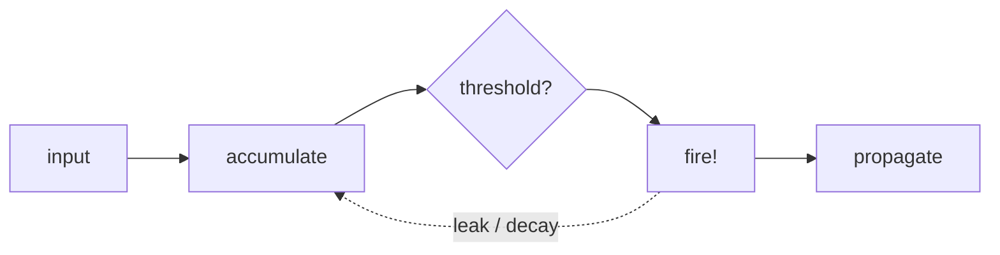
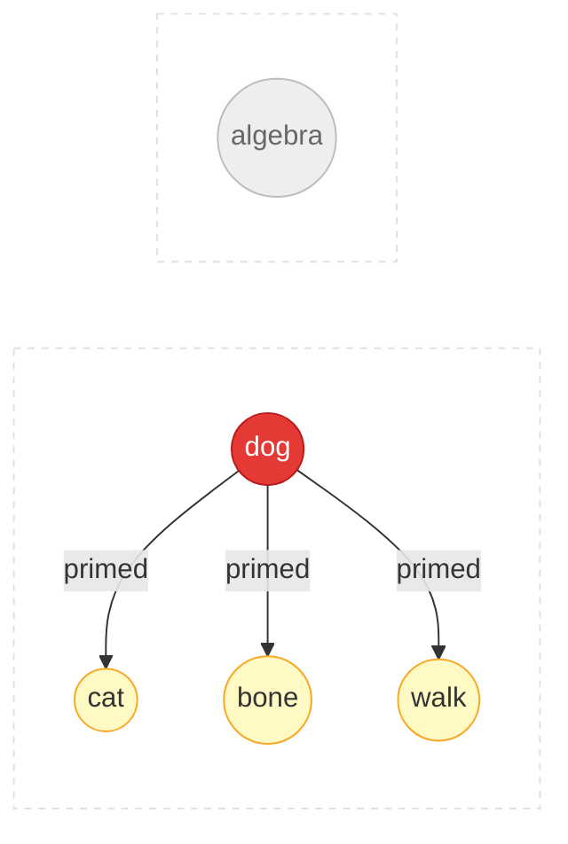

# Appendix: Algorithms & Technical Details

This page covers the technical foundations of Spikuit. For a higher-level
overview, see [Concepts](concepts.md).

## Theoretical Background

Spikuit draws from three fields:

### Neuroscience

**Neurons and Spikes**



- Biological neurons communicate through discrete electrical pulses (action potentials)
- A neuron accumulates input, fires when it crosses a threshold, then resets
- In Spikuit: a `Spike` = a review event; firing propagates signal to connected knowledge

**Synaptic Plasticity (STDP)**

> "Neurons that fire together wire together" — Hebb, 1949

Spike-Timing-Dependent Plasticity refines Hebb's rule with temporal direction:

<div class="chart-container">
  <canvas data-chart="stdp"></canvas>
</div>

- Pre fires before post (causal) → connection strengthens (LTP)
- Post fires before pre (reverse) → connection weakens (LTD)
- Magnitude decays exponentially with `|dt|`
- In Spikuit: edge weights update based on co-fire timing within `tau_stdp` days (default: 7)

**Leaky Integrate-and-Fire (LIF)**

<div class="chart-container">
  <canvas data-chart="lif"></canvas>
</div>

- Neurons accumulate input (integration) and gradually lose charge (leak)
- High pressure = the system is telling you this concept needs review
- In Spikuit: neighbor reviews push pressure up, time decays it exponentially

**Spreading Activation**



- Activating a concept in memory primes related concepts (Collins & Loftus, 1975)
- In Spikuit: reviewing one node sends activation to graph neighbors via APPNP (Personalized PageRank)

### Cognitive / Developmental Psychology

**Forgetting Curve and Spaced Repetition**

<div class="chart-container">
  <canvas data-chart="forgetting-curve"></canvas>
</div>

- Memory decays exponentially over time (Ebbinghaus, 1885)
- Each successful retrieval strengthens the trace and slows future decay
- Optimal timing: review just before you'd forget
- In Spikuit: FSRS v6 models per-neuron stability and difficulty

**Testing Effect**

- Actively retrieving > passively re-reading (Roediger & Karpicke, 2006)
- Even failed retrieval attempts improve later recall
- In Spikuit: the Learn protocol is "present → evaluate", not just "show content"

**ZPD and Scaffolding**

<div class="zpd-diagram">
  <div class="zpd-outer">
    <span class="zpd-label">Can't do (yet)</span>
    <div class="zpd-mid">
      <span class="zpd-label">ZPD: can do with support</span>
      <div class="zpd-inner">
        <span class="zpd-label">Can do alone</span>
        <span class="zpd-sublabel">(mastered)</span>
      </div>
    </div>
  </div>
</div>

- ZPD (Vygotsky, 1978): the gap between what you can do alone vs. with guidance
- Scaffolding (Wood, Bruner & Ross, 1976): temporary support, gradually removed as competence grows
- In Spikuit: Scaffold level computed from FSRS state + graph neighbors

**Schema Theory**

- Schemas = mental frameworks that organize knowledge (Bartlett, 1932; Piaget)
- New info is easier to learn when it connects to existing schemas
- In Spikuit: the knowledge graph *is* the schema; `LearnSession.ingest()` auto-discovers related concepts

### Graph-Based ML

**PageRank and APPNP**

- PageRank (Page et al., 1999): score nodes by link structure
- APPNP (Gasteiger et al., 2019): Personalized PageRank with teleport probability for locality control
- In Spikuit: used for spreading activation and retrieve scoring

---

## Algorithm Details

### FSRS

Per-neuron spaced repetition (stability, difficulty, next review date).
Propagation never touches FSRS state — only affects pressure.

### APPNP Propagation

Personalized PageRank spreading:

```
Z = (1 - alpha) * A_hat @ Z + alpha * H
```

- `alpha` = teleport probability (higher = more local, default: 0.15)
- `A_hat` = normalized adjacency with self-loops
- `H` = initial activation (grade-dependent)

### STDP Edge Weight Updates

Edge weights update from co-fire timing within `tau_stdp` days:

- Pre before post (LTP): `dw = +a_plus * exp(-|dt| / tau)`
- Post before pre (LTD): `dw = -a_minus * exp(-|dt| / tau)`

### LIF Pressure Model

Pressure accumulates from neighbor fires, decays exponentially:

```
pressure(t) = pressure * exp(-dt / tau_m)
```

### Retrieve Scoring

```
score = max(keyword_sim, semantic_sim) × (1 + retrievability + centrality + pressure + boost)
```

Semantic similarity uses sqlite-vec KNN search when an embedder is configured.
Retrieval boost is accumulated through QABotSession feedback.

### How `fire()` works

```
circuit.fire(spike)
  1. Record spike to DB
  2. FSRS: update stability, difficulty, schedule next review
  3. APPNP: propagate activation to neighbors (pressure deltas)
  4. Reset source neuron pressure
  5. STDP: update edge weights based on co-fire timing
  6. Record last-fire timestamp for future STDP
```

---

## Plasticity Parameters

| Parameter | Default | What it controls |
|-----------|---------|-----------------|
| `alpha` | 0.15 | APPNP teleport probability (locality) |
| `propagation_steps` | 5 | APPNP iteration count |
| `tau_stdp` | 7.0 | STDP time window (days) |
| `a_plus` | 0.03 | STDP LTP amplitude |
| `a_minus` | 0.036 | STDP LTD amplitude |
| `tau_m` | 14.0 | LIF membrane time constant (days) |
| `pressure_threshold` | 0.8 | LIF pressure threshold |
| `weight_floor` | 0.05 | Minimum edge weight |
| `weight_ceiling` | 1.0 | Maximum edge weight |

## Embedder Providers

| Provider | API | Use case |
|----------|-----|----------|
| `openai-compat` | `/v1/embeddings` | LM Studio, Ollama /v1, vLLM, OpenAI |
| `ollama` | `/api/embed` | Ollama native API |
| `none` | — | No embeddings (keyword-only search) |

## Neuron Model Mapping

| Brain | Spikuit | Role |
|-------|---------|------|
| Neuron | `Neuron` | A unit of knowledge (Markdown) |
| Synapse | `Synapse` | Typed, weighted connection |
| Spike | `Spike` | A review event (action potential) |
| Circuit | `Circuit` | The full knowledge graph |
| Plasticity | `Plasticity` | Tunable learning parameters |

## Tech Stack

| Component | Technology |
|-----------|-----------|
| Models | msgspec.Struct |
| Storage | SQLite (aiosqlite) + NetworkX + sqlite-vec |
| Scheduling | FSRS v6 |
| Embeddings | httpx (OpenAI-compat / Ollama) |
| CLI | Typer |
| Visualization | pyvis (vis.js) |
| Language | Python 3.11+ |
