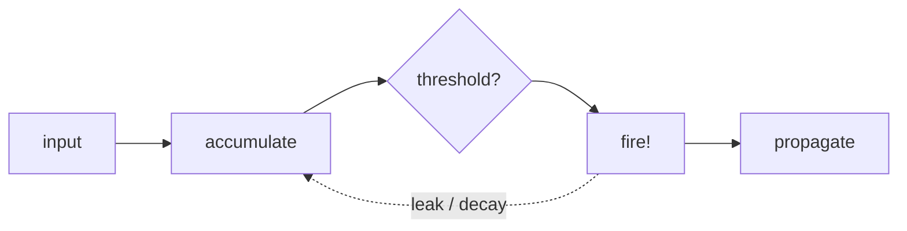
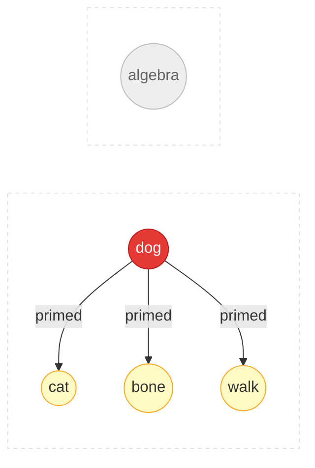

# Appendix: Algorithms & Technical Details

This page covers the technical foundations of Spikuit. For a higher-level
overview, see [Concepts](concepts.md).

---

## 1. Computational Neuroscience

Spikuit models knowledge dynamics using simplified neural mechanisms.

### Neurons and Spikes



- Biological neurons communicate through discrete electrical pulses (action potentials)
- A neuron accumulates input, fires when it crosses a threshold, then resets
- In Spikuit: a `Spike` = a review event; firing propagates signal to connected knowledge

### Synaptic Plasticity (STDP)

> "Neurons that fire together wire together" — Hebb, 1949

Spike-Timing-Dependent Plasticity refines Hebb's rule with temporal direction:

<div class="chart-container">
  <canvas data-chart="stdp"></canvas>
</div>

- Pre fires before post (causal) → connection strengthens (LTP)
- Post fires before pre (reverse) → connection weakens (LTD)
- Magnitude decays exponentially with `|dt|`
- In Spikuit: edge weights update based on co-fire timing within `tau_stdp` days (default: 7)

### Leaky Integrate-and-Fire (LIF)

<div class="chart-container">
  <canvas data-chart="lif"></canvas>
</div>

- Neurons accumulate input (integration) and gradually lose charge (leak)
- High pressure = the system is telling you this concept needs review
- In Spikuit: neighbor reviews push pressure up, time decays it exponentially

### Spreading Activation



- Activating a concept in memory primes related concepts (Collins & Loftus, 1975)
- In Spikuit: reviewing one node sends activation to graph neighbors via APPNP (Personalized PageRank)

### Sleep-Inspired Consolidation

Memory consolidation during sleep involves multiple phases:

- **Slow-Wave Sleep (SWS)**: Replays and strengthens important memories
- **Synaptic Homeostasis (SHY)**: Globally downscales synaptic weights to prevent saturation (Tononi & Cirelli, 2003)
- **REM**: Reorganizes and abstracts — detects patterns across memories

In Spikuit: `consolidate` runs a 4-phase plan: Triage (classify synapses) → SHY (decay weak connections) → SWS (prune dead weight) → REM (detect consolidation opportunities).

### References — Computational Neuroscience

- Hodgkin, A. L. & Huxley, A. F. (1952). A quantitative description of membrane current and its application to conduction and excitation in nerve. *Journal of Physiology*, 117(4), 500–544.
- Hebb, D. O. (1949). *The Organization of Behavior*. Wiley.
- Bi, G. & Poo, M. (1998). Synaptic modifications in cultured hippocampal neurons: dependence on spike timing, synaptic strength, and postsynaptic cell type. *Journal of Neuroscience*, 18(24), 10464–10472.
- Collins, A. M. & Loftus, E. F. (1975). A spreading-activation theory of semantic processing. *Psychological Review*, 82(6), 407–428.
- Tononi, G. & Cirelli, C. (2003). Sleep and synaptic homeostasis: a hypothesis. *Brain Research Bulletin*, 62(2), 143–150.
- Tononi, G. & Cirelli, C. (2014). Sleep and the price of plasticity: from synaptic and cellular homeostasis to memory consolidation and integration. *Neuron*, 81(1), 12–34.

---

## 2. Cognitive & Developmental Psychology

### Forgetting Curve and Spaced Repetition

<div class="chart-container">
  <canvas data-chart="forgetting-curve"></canvas>
</div>

- Memory decays exponentially over time (Ebbinghaus, 1885)
- Each successful retrieval strengthens the trace and slows future decay
- Optimal timing: review just before you'd forget
- In Spikuit: FSRS v6 models per-neuron stability and difficulty

### Testing Effect

- Actively retrieving > passively re-reading (Roediger & Karpicke, 2006)
- Even failed retrieval attempts improve later recall
- In Spikuit: the Learn protocol is "present → evaluate", not just "show content"

### ZPD and Scaffolding

<div class="zpd-diagram">
  <div class="zpd-outer">
    <span class="zpd-label">Can't do (yet)</span>
    <div class="zpd-mid">
      <span class="zpd-label">ZPD: can do with support</span>
      <div class="zpd-inner">
        <span class="zpd-label">Can do alone</span>
        <span class="zpd-sublabel">(mastered)</span>
      </div>
    </div>
  </div>
</div>

- ZPD (Vygotsky, 1978): the gap between what you can do alone vs. with guidance
- Scaffolding (Wood, Bruner & Ross, 1976): temporary support, gradually removed as competence grows
- In Spikuit: Scaffold level computed from FSRS state + graph neighbors

### Schema Theory

- Schemas = mental frameworks that organize knowledge (Bartlett, 1932; Piaget)
- New info is easier to learn when it connects to existing schemas
- In Spikuit: the knowledge graph *is* the schema; `LearnSession.ingest()` auto-discovers related concepts

### References — Cognitive & Developmental Psychology

- Ebbinghaus, H. (1885). *Über das Gedächtnis*. Duncker & Humblot. (English translation: *Memory: A Contribution to Experimental Psychology*, 1913.)
- Bartlett, F. C. (1932). *Remembering: A Study in Experimental and Social Psychology*. Cambridge University Press.
- Vygotsky, L. S. (1978). *Mind in Society: The Development of Higher Psychological Processes*. Harvard University Press.
- Wood, D., Bruner, J. S. & Ross, G. (1976). The role of tutoring in problem solving. *Journal of Child Psychology and Psychiatry*, 17(2), 89–100.
- Roediger, H. L. & Karpicke, J. D. (2006). Test-enhanced learning: taking memory tests improves long-term retention. *Psychological Science*, 17(3), 249–255.
- Piaget, J. (1952). *The Origins of Intelligence in Children*. International Universities Press.

---

## 3. Spaced Repetition Systems

### FSRS (Free Spaced Repetition Scheduler)

Per-neuron spaced repetition (stability, difficulty, next review date).
FSRS v6 is a neural-network-based scheduler that outperforms SM-2 (Anki's default)
on recall prediction accuracy.

- Propagation never touches FSRS state — only affects pressure
- Each neuron maintains independent stability and difficulty parameters
- Grade mapping: `miss` → Again, `weak` → Hard, `fire` → Good, `strong` → Easy

### References — Spaced Repetition

- Ye, J. (2024). FSRS: A modern spaced repetition algorithm. [github.com/open-spaced-repetition/fsrs4anki](https://github.com/open-spaced-repetition/fsrs4anki)
- Wozniak, P. A. & Gorzelanczyk, E. J. (1994). Optimization of repetition spacing in the practice of learning. *Acta Neurobiologiae Experimentalis*, 54, 59–62.
- Leitner, S. (1972). *So lernt man lernen*. Herder.

---

## 4. Knowledge Graphs & Graph-Based ML

### PageRank and APPNP

- PageRank (Page et al., 1999): score nodes by link structure
- APPNP (Gasteiger et al., 2019): Personalized PageRank with teleport probability for locality control
- In Spikuit: used for spreading activation and retrieve scoring

### Community Detection

- Louvain algorithm (Blondel et al., 2008): detects communities by modularity optimization
- In Spikuit: clusters densely connected neurons, enables community-boosted retrieval and summary generation

### References — Knowledge Graphs & Graph-Based ML

- Page, L., Brin, S., Motwani, R. & Winograd, T. (1999). The PageRank Citation Ranking: Bringing Order to the Web. *Stanford InfoLab Technical Report*.
- Gasteiger, J., Bojchevski, A. & Günnemann, S. (2019). Predict then Propagate: Graph Neural Networks meet Personalized PageRank. *ICLR 2019*.
- Blondel, V. D., Guillaume, J.-L., Lambiotte, R. & Lefebvre, E. (2008). Fast unfolding of communities in large networks. *Journal of Statistical Mechanics*, P10008.

---

## 5. Information Retrieval & RAG

### Hybrid Retrieval

Spikuit combines multiple retrieval signals into a single score:

```
score = max(keyword_sim, semantic_sim) × (1 + retrievability + centrality + pressure + boost)
```

- **Keyword similarity**: BM25-style text matching
- **Semantic similarity**: sqlite-vec KNN search when an embedder is configured
- **Retrievability**: FSRS-based memory strength (concepts you know well rank higher)
- **Centrality**: graph-structural importance
- **Pressure**: LIF-based urgency from neighbor reviews
- **Feedback boost**: accumulated through QABotSession accept/reject signals

### Retrieval-Augmented Generation (RAG)

Traditional RAG pipelines require significant preprocessing: document chunking,
metadata extraction, embedding pipeline setup. Spikuit replaces this with
conversational curation — the agent handles chunking, tagging, and connecting
through dialogue via `/spkt-learn`.

### References — Information Retrieval & RAG

- Robertson, S. & Zaragoza, H. (2009). The Probabilistic Relevance Framework: BM25 and Beyond. *Foundations and Trends in Information Retrieval*, 3(4), 333–389.
- Lewis, P. et al. (2020). Retrieval-Augmented Generation for Knowledge-Intensive NLP Tasks. *NeurIPS 2020*.

---

## Algorithm Details

### APPNP Propagation

Personalized PageRank spreading:

```
Z = (1 - alpha) * A_hat @ Z + alpha * H
```

- `alpha` = teleport probability (higher = more local, default: 0.15)
- `A_hat` = normalized adjacency with self-loops
- `H` = initial activation (grade-dependent)

### STDP Edge Weight Updates

Edge weights update from co-fire timing within `tau_stdp` days:

- Pre before post (LTP): `dw = +a_plus * exp(-|dt| / tau)`
- Post before pre (LTD): `dw = -a_minus * exp(-|dt| / tau)`

### LIF Pressure Model

Pressure accumulates from neighbor fires, decays exponentially:

```
pressure(t) = pressure * exp(-dt / tau_m)
```

### How `fire()` works

```
circuit.fire(spike)
  1. Record spike to DB
  2. FSRS: update stability, difficulty, schedule next review
  3. APPNP: propagate activation to neighbors (pressure deltas)
  4. Reset source neuron pressure
  5. STDP: update edge weights based on co-fire timing
  6. Record last-fire timestamp for future STDP
```

---

## Plasticity Parameters

| Parameter | Default | What it controls |
|-----------|---------|-----------------|
| `alpha` | 0.15 | APPNP teleport probability (locality) |
| `propagation_steps` | 5 | APPNP iteration count |
| `tau_stdp` | 7.0 | STDP time window (days) |
| `a_plus` | 0.03 | STDP LTP amplitude |
| `a_minus` | 0.036 | STDP LTD amplitude |
| `tau_m` | 14.0 | LIF membrane time constant (days) |
| `pressure_threshold` | 0.8 | LIF pressure threshold |
| `weight_floor` | 0.05 | Minimum edge weight |
| `weight_ceiling` | 1.0 | Maximum edge weight |

## Embedding Pipeline

### Input Preparation

Before embedding, neuron content goes through a preparation pipeline:

```
Raw neuron content
  → strip YAML frontmatter
  → prepend [Section: ...] from frontmatter (if present)
  → prepend [key: value] from source searchable metadata (truncated to max_searchable_chars)
  → final embedding input
```

This ensures embeddings capture semantic context beyond the raw text,
while excluding structural noise (frontmatter keys, formatting).

### Task-Type Prefixes

Many embedding models perform better when the input is tagged with its
purpose (document vs. query). Spikuit supports this via `prefix_style`
in `config.toml`:

```toml
[embedder]
prefix_style = "nomic"    # "nomic", "google", "cohere", "none"
```

| Style | Document prefix | Query prefix |
|-------|----------------|--------------|
| `nomic` | `search_document: ` | `search_query: ` |
| `google` | `RETRIEVAL_DOCUMENT: ` | `RETRIEVAL_QUERY: ` |
| `cohere` | `search_document: ` | `search_query: ` |
| `none` (default) | — | — |

The prefix is applied automatically:
- `EmbeddingType.DOCUMENT` when adding/updating neurons and running `embed-all`
- `EmbeddingType.QUERY` when calling `retrieve()`

### Searchable Metadata Formula

When a neuron has source searchable metadata, the embedding input becomes:

```
[key1: value1] [key2: value2] [Section: section_name] body_text
```

Total searchable content is truncated to `max_searchable_chars` (default: 500)
to prevent metadata from dominating the embedding.

## Embedder Providers

| Provider | API | Use case |
|----------|-----|----------|
| `openai-compat` | `/v1/embeddings` | LM Studio, Ollama /v1, vLLM, OpenAI |
| `ollama` | `/api/embed` | Ollama native API |
| `none` | — | No embeddings (keyword-only search) |

## Neuron Model Mapping

| Brain | Spikuit | Role |
|-------|---------|------|
| Neuron | `Neuron` | A unit of knowledge (Markdown) |
| Synapse | `Synapse` | Typed, weighted connection |
| Spike | `Spike` | A review event (action potential) |
| Circuit | `Circuit` | The full knowledge graph |
| Plasticity | `Plasticity` | Tunable learning parameters |

## Tech Stack

| Component | Technology |
|-----------|-----------|
| Models | msgspec.Struct |
| Storage | SQLite (aiosqlite) + NetworkX + sqlite-vec |
| Scheduling | FSRS v6 |
| Embeddings | httpx (OpenAI-compat / Ollama) |
| CLI | Typer |
| Visualization | pyvis (vis.js) |
| Language | Python 3.11+ |
