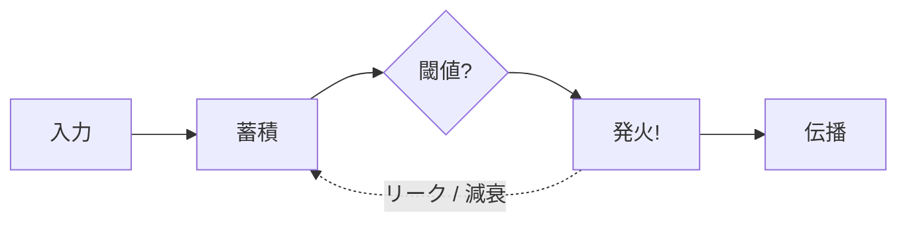
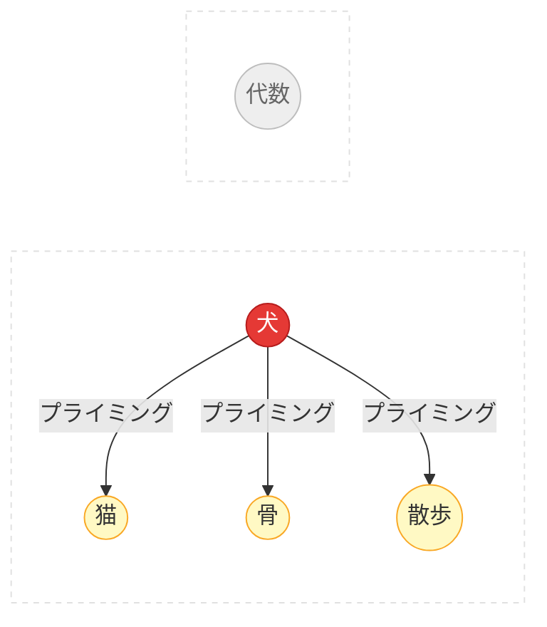

# 計算神経科学

Spikuitは神経科学の仕組みを簡略化して、知識のダイナミクスに応用しています。

### ニューロンとスパイク

- 生物のニューロンは電気パルス（活動電位）でやり取りする
- 入力が蓄積して閾値を超えると発火し、リセットされる
- Spikuitでは: `Spike` = 復習イベント。発火するとつながった知識に信号が伝わる

### シナプス可塑性 (STDP)

> 「一緒に発火するニューロンは結びつく」 — Hebb, 1949

STDPはHebbの法則に「時間の向き」を加えた精緻化です:

  <canvas data-chart="stdp"></canvas>

- プレがポストより先に発火（因果的）→ 接続が強まる（LTP）
- ポストがプレより先に発火（逆因果）→ 接続が弱まる（LTD）
- 変化量は`|dt|`に対して指数的に減衰
- Spikuitでは: `tau_stdp`日（デフォルト: 7）以内の共発火でエッジ重みを更新

### 漏れ積分発火モデル (LIF)

  <canvas data-chart="lif"></canvas>

- ニューロンは入力を蓄積（積分）しつつ、徐々に電荷が抜けていく（漏れ）
- 圧力が高い = 「この概念は復習したほうがいい」というシグナル
- Spikuitでは: 近傍の復習で圧力が上がり、時間とともに指数的に減衰

### 活性化拡散

- ある概念を活性化すると、関連する概念も一緒にプライミングされる（Collins & Loftus, 1975）
- Spikuitでは: 1つのノードを復習するとAPPNP（Personalized PageRank）でグラフ近傍に活性化が広がる

### 睡眠にヒントを得た統合

睡眠中の記憶統合には複数のフェーズがあります:

- **徐波睡眠 (SWS)**: 大事な記憶をリプレイして強化する
- **シナプスホメオスタシス (SHY)**: シナプスの重みを全体的に下げて飽和を防ぐ（Tononi & Cirelli, 2003）
- **REM**: 記憶を再編成・抽象化し、パターンを見つけ出す

Spikuitの`consolidate`はこれを4フェーズの計画として実行します: Triage（Synapseの分類）→ SHY（弱い接続の減衰）→ SWS（不要な接続の剪定）→ REM（統合機会の検出）

### 参考文献

- Hodgkin, A. L. & Huxley, A. F. (1952). A quantitative description of membrane current and its application to conduction and excitation in nerve. *Journal of Physiology*, 117(4), 500–544.
- Hebb, D. O. (1949). *The Organization of Behavior*. Wiley.
- Bi, G. & Poo, M. (1998). Synaptic modifications in cultured hippocampal neurons: dependence on spike timing, synaptic strength, and postsynaptic cell type. *Journal of Neuroscience*, 18(24), 10464–10472.
- Collins, A. M. & Loftus, E. F. (1975). A spreading-activation theory of semantic processing. *Psychological Review*, 82(6), 407–428.
- Tononi, G. & Cirelli, C. (2003). Sleep and synaptic homeostasis: a hypothesis. *Brain Research Bulletin*, 62(2), 143–150.
- Tononi, G. & Cirelli, C. (2014). Sleep and the price of plasticity: from synaptic and cellular homeostasis to memory consolidation and integration. *Neuron*, 81(1), 12–34.
