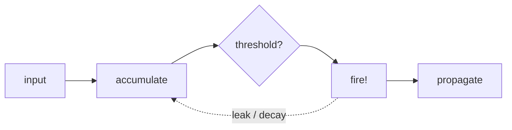
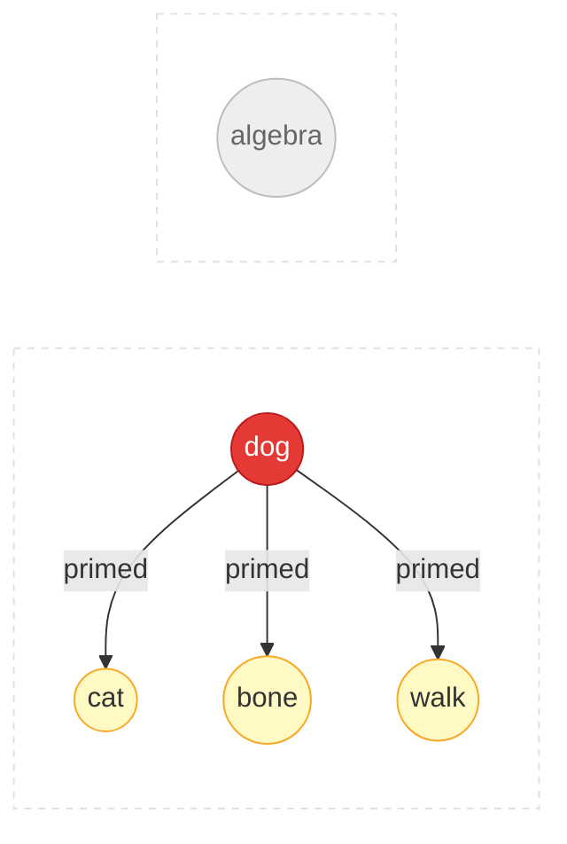

# Computational Neuroscience

Spikuit models knowledge dynamics using simplified neural mechanisms.

### Neurons and Spikes

- Biological neurons communicate through discrete electrical pulses (action potentials)
- A neuron accumulates input, fires when it crosses a threshold, then resets
- In Spikuit: a `Spike` = a review event; firing propagates signal to connected knowledge

### Synaptic Plasticity (STDP)

> "Neurons that fire together wire together" — Hebb, 1949

Spike-Timing-Dependent Plasticity refines Hebb's rule with temporal direction:

  <canvas data-chart="stdp"></canvas>

- Pre fires before post (causal) → connection strengthens (LTP)
- Post fires before pre (reverse) → connection weakens (LTD)
- Magnitude decays exponentially with `|dt|`
- In Spikuit: edge weights update based on co-fire timing within `tau_stdp` days (default: 7)

### Leaky Integrate-and-Fire (LIF)

  <canvas data-chart="lif"></canvas>

- Neurons accumulate input (integration) and gradually lose charge (leak)
- High pressure = the system is telling you this concept needs review
- In Spikuit: neighbor reviews push pressure up, time decays it exponentially

### Spreading Activation

- Activating a concept in memory primes related concepts (Collins & Loftus, 1975)
- In Spikuit: reviewing one node sends activation to graph neighbors via APPNP (Personalized PageRank)

### Sleep-Inspired Consolidation

Memory consolidation during sleep involves multiple phases:

- **Slow-Wave Sleep (SWS)**: Replays and strengthens important memories
- **Synaptic Homeostasis (SHY)**: Globally downscales synaptic weights to prevent saturation (Tononi & Cirelli, 2003)
- **REM**: Reorganizes and abstracts — detects patterns across memories

In Spikuit: `consolidate` runs a 4-phase plan: Triage (classify synapses) → SHY (decay weak connections) → SWS (prune dead weight) → REM (detect consolidation opportunities).

### References

- Hodgkin, A. L. & Huxley, A. F. (1952). A quantitative description of membrane current and its application to conduction and excitation in nerve. *Journal of Physiology*, 117(4), 500–544.
- Hebb, D. O. (1949). *The Organization of Behavior*. Wiley.
- Bi, G. & Poo, M. (1998). Synaptic modifications in cultured hippocampal neurons: dependence on spike timing, synaptic strength, and postsynaptic cell type. *Journal of Neuroscience*, 18(24), 10464–10472.
- Collins, A. M. & Loftus, E. F. (1975). A spreading-activation theory of semantic processing. *Psychological Review*, 82(6), 407–428.
- Tononi, G. & Cirelli, C. (2003). Sleep and synaptic homeostasis: a hypothesis. *Brain Research Bulletin*, 62(2), 143–150.
- Tononi, G. & Cirelli, C. (2014). Sleep and the price of plasticity: from synaptic and cellular homeostasis to memory consolidation and integration. *Neuron*, 81(1), 12–34.
