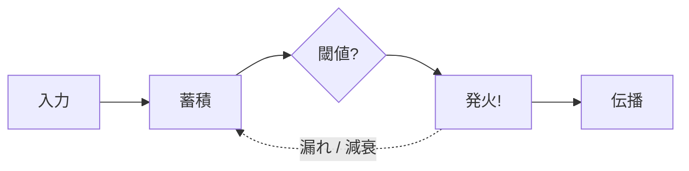
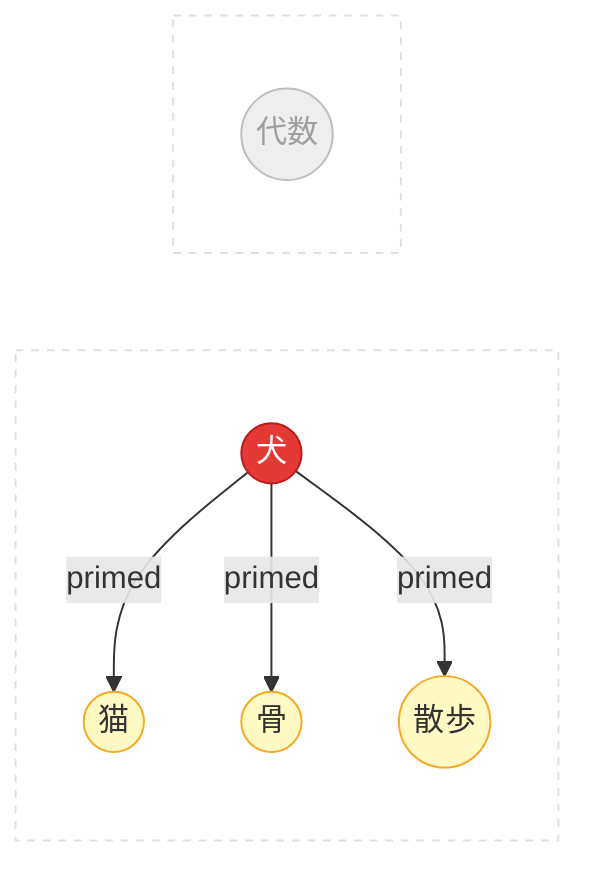

# コンセプト

## 背景知識

Spikuitの設計は3つの分野から着想を得ています。それぞれの要点を簡潔にまとめます。

### 神経科学

#### ニューロンとスパイク



- 生体ニューロンは離散的な電気パルス（活動電位）で通信する
- 入力を蓄積し、閾値を超えると発火、その後リセット
- Spikuitでは: `Spike` = 復習イベント。発火するとつながった知識に信号が伝播する

#### シナプス可塑性

> "一緒に発火するニューロンは結びつく" -- Hebb, 1949

- 時間的に近い活性化でニューロン間の接続が強化される
- 連合学習の生物学的基盤
- Spikuitでは: 時間窓内に関連概念を復習すると、STDPでエッジ重みが強化される

#### STDP（スパイクタイミング依存可塑性）

ヘッブ則に時間的方向性を加えたもの:

<div class="chart-container">
  <canvas data-chart="stdp"></canvas>
</div>

- Pre→Post の順（因果的）→ 接続強化（LTP: 長期増強）
- Post→Pre の順（逆順）→ 接続弱化（LTD: 長期抑圧）
- 変化量は `|dt|` に対して指数的に減衰
- Spikuitでは: `tau_stdp` 日（デフォルト7日）以内の共発火でエッジ重みが更新

#### LIF（漏れ積分発火モデル）

<div class="chart-container">
  <canvas data-chart="lif"></canvas>
</div>

- ニューロンは入力を蓄積（積分）しつつ、徐々に電荷を失う（漏れ）
- 高圧力 = 「この概念は復習が必要」というシステムからのサイン
- Spikuitでは: 近傍の復習が圧力を上げ、時間が指数関数的に減衰させる

#### 拡散活性化



- 概念の活性化が連合リンクを通じて関連概念に広がる（Collins & Loftus, 1975）
- 「犬」→「猫」「骨」はプライミングされるが「代数」はされない
- Spikuitでは: APPNP（Personalized PageRank）で復習した概念からグラフ近傍に活性化を送る

### 認知心理学・発達心理学

#### 忘却曲線と間隔反復

<div class="chart-container">
  <canvas data-chart="forgetting-curve"></canvas>
</div>

- 記憶は時間とともに指数関数的に減衰する（Ebbinghaus, 1885）
- 検索成功のたびに記憶痕跡が強化され、将来の減衰が遅くなる
- 最適タイミング: 忘れる直前に復習する
- Spikuitでは: FSRS v6がニューロン単位のstabilityとdifficultyをモデル化

#### テスティング効果

- 能動的な検索 > 受動的な再読（Roediger & Karpicke, 2006）
- 失敗した検索試行でさえ後の想起を改善する
- Spikuitでは: Learnプロトコルは「提示→評価」構造。Scaffoldが表示量を制御

#### ZPDとスキャフォールディング

<div class="zpd-diagram">
  <div class="zpd-outer">
    <span class="zpd-label">まだできない</span>
    <div class="zpd-mid">
      <span class="zpd-label">ZPD: 支援があればできる</span>
      <div class="zpd-inner">
        <span class="zpd-label">独力でできる</span>
        <span class="zpd-sublabel">（習得済み）</span>
      </div>
    </div>
  </div>
</div>

- ZPD（Vygotsky, 1978）: 独力でできることと、支援があればできることのギャップ
- スキャフォールディング（Wood, Bruner & Ross, 1976）: 能力向上に伴い撤去される一時的サポート
- Spikuitでは: FSRS状態からScaffoldレベルを算出

| レベル | 条件 | サポート内容 |
|--------|------|-------------|
| FULL | 新規 / Learning | フルコンテンツ、最大ヒント |
| GUIDED | Relearning / 低stability | 部分コンテンツ、ヒント利用可 |
| MINIMAL | 中程度のstability | タイトルのみ、難しい問題 |
| NONE | 高stability | 純粋な想起 |

追加で特定するもの:

- Context: すでに知っている強い近傍（スキャフォールディング素材）
- Gaps: 弱い前提条件（先に学習すべきもの）

#### スキーマ理論

- スキーマ = 知識を組織化する心的枠組み（Bartlett, 1932; Piaget）
- 既存スキーマに接続できると新情報の学習が容易になる（同化）
- Spikuitでは: ナレッジグラフ自体がスキーマ。`LearnSession.ingest()` が関連概念を自動発見して接続

### グラフベースML

#### PageRankとAPPNP

- PageRank（Page et al., 1999）: リンク構造からノードをスコアリング
- APPNP（Gasteiger et al., 2019）: テレポート確率で伝播をローカルに保つPersonalized PageRank
- Spikuitでの用途:
    - 拡散活性化: 1ノード復習 → 近傍に圧力
    - 検索スコアリング: 中心性がランキングに寄与

---

## アーキテクチャ

```
spikuit/
├── spikuit-core/          # 純粋エンジン
│   ├── models.py          #   Neuron, Synapse, Spike, Plasticity, Scaffold
│   ├── circuit.py         #   公開API: fire, retrieve, ensemble, due
│   ├── propagation.py     #   APPNP拡散 + STDP + LIF減衰
│   ├── db.py              #   非同期SQLite + sqlite-vec 永続化
│   ├── embedder.py        #   差し替え可能な埋め込みプロバイダー
│   ├── session.py         #   セッション抽象化（QABot、Learn）
│   ├── scaffold.py        #   ZPD着想のスキャフォールディング
│   ├── learn.py           #   学習プロトコル（Flashcard、拡張可能）
│   └── config.py          #   .spikuit/ Brain設定と探索
├── spikuit-cli/           # spkt コマンド (Typer)
└── spikuit-agents/        # エージェントアダプター（予定）
```

### Coreレイヤー（LLM不要）

- **Circuit**: ナレッジグラフエンジン（FSRS + NetworkX + 伝播 + sqlite-vec）
- **Embedder**: 差し替え可能な埋め込み（OpenAICompat, Ollama, Null）。追加・更新時に自動埋め込み
- **Scaffold**: ZPD着想のサポートレベル（FULL/GUIDED/MINIMAL/NONE）。FSRS状態 + グラフ近傍から算出
- **Flashcard**: セルフグレードクイズ、LLM不要

### Sessionレイヤー（LLM駆動）

- **QABotSession**: RAGチャット — LLMが検索結果から回答を生成（ネガティブフィードバック、受諾、重複排除、永続/一時）
- **LearnSession**: ナレッジキュレーション — 対話を通じてニューロン追加、関連発見、重複統合
- **TutorSession**: 1対1チュータリング — スキャフォールド型指導、ヒント段階開示、ギャップ検出、誤答解説（予定）

### Quiz（セッションが使う評価ツール）

- **Flashcard**（core）: セルフグレード、LLM不要
- **AutoQuiz**（予定）: LLM生成問題、プログラム的採点
- 1 Quiz : N Neurons — QuizRequestにprimary + supporting neurons、QuizResultにニューロン単位のグレード

## Spikuitのアルゴリズム

### FSRS

- ニューロン単位の間隔反復（stability, difficulty, 次回復習日）
- 伝播はFSRS状態に一切触れない -- 影響するのは圧力だけ

### APPNP

Personalized PageRank伝播:

```
Z = (1 - alpha) * A_hat @ Z + alpha * H
```

- `alpha` = テレポート確率（高いほどローカル）
- `A_hat` = 自己ループ付き正規化隣接行列
- `H` = 初期活性化（グレード依存）

### STDP

`tau_stdp` 日以内の共発火でエッジ重み更新:

- Pre→Post順（LTP）: `dw = +a_plus * exp(-|dt| / tau)`
- Post→Pre順（LTD）: `dw = -a_minus * exp(-|dt| / tau)`

### LIF

近傍発火で蓄積、指数的に減衰:

```
pressure(t) = pressure * exp(-dt / tau_m)
```

## セッション

LLM駆動のインタラクションモード。各セッションはCoreエンジンを会話型インターフェースで包む。

### QABotSession

自己最適化するRAGチャット:

- ネガティブフィードバック: 類似フォローアップが前回結果をペナルティ
- Accept: 正のフィードバックでニューロンをブースト
- 重複排除: 既返却ニューロンを除外
- 永続 or 一時モード

### LearnSession

会話型ナレッジキュレーション:

- `ingest()`: ニューロン追加 + 関連概念を自動発見
- `relate()`: シナプス作成・強化
- `search()`: グラフ重み付き検索
- `merge()`: 重複統合（シナプス転送 + コンテンツ結合）

### TutorSession（予定）

1対1スキャフォールド型チュータリング:

- ヒント段階開示: Scaffoldレベルに基づき情報を段階的に開示
- ギャップ検出: グラフ近傍から弱い前提条件を特定
- 誤答解説: 不正解から誤解を診断

### 会話型RAGキュレーション

従来のRAGはナレッジベースを静的に扱う。Spikuitのグラフは生きている
-- 復習、結果の受諾、キュレーション操作のすべてが構造を改善する。
使うほど良くなるRAGシステム。

## Embedder

| プロバイダー | API | ユースケース |
|-------------|-----|-------------|
| `openai-compat` | `/v1/embeddings` | LM Studio, Ollama /v1, vLLM, OpenAI |
| `ollama` | `/api/embed` | Ollamaネイティブ API |
| `none` | -- | 埋め込みなし（キーワードのみ） |

検索スコアリング:

```
score = max(キーワード類似度, 意味的類似度) * (1 + 検索可能性 + 中心性 + 圧力 + ブースト)
```

## Learnプロトコル

select → scaffold → present → evaluate → record

- Flashcard: セルフグレード、LLM不要。Scaffoldがコンテンツ表示量を制御
- Quiz（agents経由）: LLM生成問題、ニューロン単位グレーディング

## 技術スタック

| コンポーネント | 技術 |
|---------------|------|
| モデル | msgspec.Struct |
| ストレージ | SQLite (aiosqlite) + NetworkX + sqlite-vec |
| スケジューリング | FSRS v6 |
| 埋め込み | httpx (OpenAI互換 / Ollama) |
| CLI | Typer |
| 可視化 | pyvis (vis.js) |
| 言語 | Python 3.11+ |
