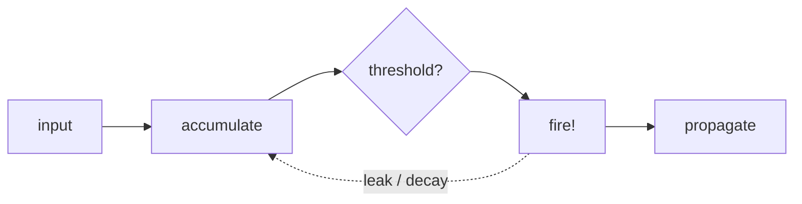
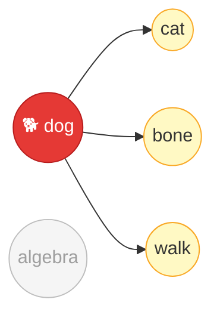

# Concepts

## Background

Spikuit draws from three fields. This section is a quick primer on each.

### Neuroscience

#### Neurons and Spikes



- Biological neurons communicate through discrete electrical pulses (action potentials)
- A neuron accumulates input, fires when it crosses a threshold, then resets
- In Spikuit: a `Spike` = a review event; firing propagates signal to connected knowledge

#### Synaptic Plasticity

> "Neurons that fire together wire together" -- Hebb, 1949

- Connections strengthen when neurons activate in close temporal proximity
- This is the basis of associative learning
- In Spikuit: reviewing related concepts within a time window strengthens their edge weight (via STDP)

#### STDP (Spike-Timing-Dependent Plasticity)

Refines Hebb's rule with temporal direction:

<div class="chart-container">
  <canvas data-chart="stdp"></canvas>
</div>

- Pre fires before post (causal) → connection strengthens (LTP)
- Post fires before pre (reverse) → connection weakens (LTD)
- Magnitude decays exponentially with `|dt|`
- In Spikuit: edge weights update based on co-fire timing within `tau_stdp` days (default: 7)

#### LIF (Leaky Integrate-and-Fire)

<div class="chart-container">
  <canvas data-chart="lif"></canvas>
</div>

- Neurons accumulate input (integration) and gradually lose charge (leak)
- High pressure = the system is telling you this concept needs review
- In Spikuit: neighbor reviews push pressure up, time decays it exponentially

#### Spreading Activation



- Activating a concept in memory primes related concepts (Collins & Loftus, 1975)
- "dog" primes "cat" and "bone", not "algebra"
- In Spikuit: reviewing one node sends activation to graph neighbors via APPNP (Personalized PageRank)

### Cognitive / Developmental Psychology

#### Forgetting Curve and Spaced Repetition

<div class="chart-container">
  <canvas data-chart="forgetting-curve"></canvas>
</div>

- Memory decays exponentially over time (Ebbinghaus, 1885)
- Each successful retrieval strengthens the trace and slows future decay
- Optimal timing: review just before you'd forget
- In Spikuit: FSRS v6 models per-neuron stability and difficulty

#### Testing Effect

- Actively retrieving > passively re-reading (Roediger & Karpicke, 2006)
- Even failed retrieval attempts improve later recall
- In Spikuit: the Learn protocol is "present → evaluate", not just "show content"; Scaffold controls how much is revealed

#### ZPD and Scaffolding

<div class="zpd-diagram">
  <div class="zpd-outer">
    <span class="zpd-label">Can't do (yet)</span>
    <div class="zpd-mid">
      <span class="zpd-label">ZPD: can do with support</span>
      <div class="zpd-inner">
        <span class="zpd-label">Can do alone</span>
        <span class="zpd-sublabel">(mastered)</span>
      </div>
    </div>
  </div>
</div>

- ZPD (Vygotsky, 1978): the gap between what you can do alone vs. with guidance
- Scaffolding (Wood, Bruner & Ross, 1976): temporary support, gradually removed as competence grows
- In Spikuit: Scaffold level computed from FSRS state

| Level | When | Support provided |
|-------|------|-----------------|
| FULL | New / Learning | Full content, max hints |
| GUIDED | Relearning / low stability | Partial content, hints available |
| MINIMAL | Moderate stability | Title only, harder questions |
| NONE | High stability | Pure recall |

Additionally identifies:

- Context: strong neighbors you already know (scaffolding material)
- Gaps: weak prerequisites you should study first

#### Schema Theory

- Schemas = mental frameworks that organize knowledge (Bartlett, 1932; Piaget)
- New info is easier to learn when it connects to existing schemas (assimilation)
- In Spikuit: the knowledge graph _is_ the schema; `LearnSession.ingest()` auto-discovers related concepts to connect to

### Graph-Based ML

#### PageRank and APPNP

- PageRank (Page et al., 1999): score nodes by link structure
- APPNP (Gasteiger et al., 2019): Personalized PageRank with teleport probability to keep propagation local
- In Spikuit, used for:
    - Spreading activation: review one node → neighbors get pressure
    - Retrieve scoring: centrality contributes to search ranking

---

## Architecture

```
spikuit/
├── spikuit-core/          # Pure engine
│   ├── models.py          #   Neuron, Synapse, Spike, Plasticity, Scaffold
│   ├── circuit.py         #   Public API: fire, retrieve, ensemble, due
│   ├── propagation.py     #   APPNP spreading + STDP + LIF decay
│   ├── db.py              #   Async SQLite + sqlite-vec persistence
│   ├── embedder.py        #   Pluggable embedding providers
│   ├── session.py         #   Session abstraction (QABot, Learn)
│   ├── scaffold.py        #   ZPD-inspired scaffolding
│   ├── learn.py           #   Learn protocol (Flashcard, extensible)
│   └── config.py          #   .spikuit/ brain config and discovery
├── spikuit-cli/           # spkt command (Typer)
└── spikuit-agents/        # Agent adapters (planned)
```

### Core layer (LLM-free)

- **Circuit**: Knowledge graph engine (FSRS + NetworkX + propagation + sqlite-vec)
- **Embedder**: Pluggable text embedding (OpenAICompat, Ollama, Null). Auto-embeds on add/update
- **Scaffold**: ZPD-inspired support levels (FULL/GUIDED/MINIMAL/NONE) from FSRS state + graph neighbors
- **Flashcard**: Self-grade quiz, no LLM required

### Session layer (LLM-powered)

- **QABotSession**: RAG chat — LLM generates answers from retrieval results (negative feedback, accept, dedup, persistent/ephemeral)
- **LearnSession**: Knowledge curation — add neurons, discover relations, merge duplicates through dialogue
- **TutorSession**: 1-on-1 tutoring — scaffolded teaching, hint progression, gap detection, error explanation (planned)

### Quiz (evaluation tools used by Sessions)

- **Flashcard** (core): Self-grade, no LLM
- **AutoQuiz** (planned): LLM-generated questions, programmatic grading
- 1 Quiz : N Neurons — QuizRequest has primary + supporting neurons, QuizResult has per-neuron grades

## Algorithms in Spikuit

### FSRS

- Per-neuron spaced repetition (stability, difficulty, next review date)
- Propagation never touches FSRS state -- only affects pressure

### APPNP

Personalized PageRank propagation:

```
Z = (1 - alpha) * A_hat @ Z + alpha * H
```

- `alpha` = teleport probability (higher = more local)
- `A_hat` = normalized adjacency with self-loops
- `H` = initial activation (grade-dependent)

### STDP

Edge weight updates from co-fire timing within `tau_stdp` days:

- Pre before post (LTP): `dw = +a_plus * exp(-|dt| / tau)`
- Post before pre (LTD): `dw = -a_minus * exp(-|dt| / tau)`

### LIF

Pressure accumulates from neighbor fires, decays exponentially:

```
pressure(t) = pressure * exp(-dt / tau_m)
```

## Sessions

LLM-powered interaction modes for the Brain (Circuit). Each session wraps the core engine with a conversational interface.

### QABotSession

Self-optimizing RAG chat:

- Negative feedback: similar follow-up queries penalize prior results
- Accept: positive feedback boosts neurons
- Dedup: already-returned neurons excluded
- Persistent or ephemeral mode

### LearnSession

Conversational knowledge curation:

- `ingest()`: add neuron + auto-discover related concepts
- `relate()`: create or strengthen synapses
- `search()`: graph-weighted retrieval
- `merge()`: combine duplicates (transfer synapses + content)

### TutorSession (planned)

1-on-1 scaffolded tutoring:

- Hint progression: gradually reveal information based on Scaffold level
- Gap detection: identify weak prerequisites via graph neighbors
- Error explanation: diagnose misconceptions from wrong answers

### Conversational RAG Curation

Traditional RAG treats the knowledge base as static. Spikuit's graph is
alive -- every review, accepted result, and curation action refines the
structure. A RAG system that gets better because you use it.

## Embedder

| Provider | API | Use case |
|----------|-----|----------|
| `openai-compat` | `/v1/embeddings` | LM Studio, Ollama /v1, vLLM, OpenAI |
| `ollama` | `/api/embed` | Ollama native API |
| `none` | -- | No embeddings (keyword only) |

Retrieve scoring:

```
score = max(keyword_sim, semantic_sim) * (1 + retrievability + centrality + pressure + boost)
```

## Learn Protocol

Abstract protocol: select → scaffold → present → evaluate → record

- Flashcard: self-grade, no LLM required; scaffold controls content visibility
- Quiz (via agents): LLM-generated questions, per-neuron grading

## Tech Stack

| Component | Technology |
|-----------|-----------|
| Models | msgspec.Struct |
| Storage | SQLite (aiosqlite) + NetworkX + sqlite-vec |
| Scheduling | FSRS v6 |
| Embeddings | httpx (OpenAI-compat / Ollama) |
| CLI | Typer |
| Visualization | pyvis (vis.js) |
| Language | Python 3.11+ |
